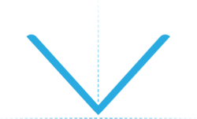

<div align="center">
	<a href="https://github.com/EricRovell/vector/actions">
		
	</a>
	<a href="https://codecov.io/gh/EricRovell/vector">
		
	</a>
</div>

<div align="center">
	<a href="https://www.npmjs.com/package/@ericrovell/vector">
		
	</a>
	<a href="https://www.npmjs.com/package/@ericrovell/vector">
		
	</a>
	<a href="https://www.npmjs.com/package/@ericrovell/vector">
		
	</a>
	<a href="https://www.npmjs.com/package/@ericrovell/vector">
		
	</a>
</div>

<div align="center">
	<a href="https://bundlephobia.com/package/@ericrovell/vector">
		
	</a>
	<a href="https://bundlephobia.com/package/@ericrovell/vector">
		
	</a>
	<a href="https://bundlephobia.com/package/@ericrovell/vector">
		
	</a>
	<a href="https://bundlephobia.com/package/@ericrovell/vector">
		
	</a>
</div>

<div align="center">
	
</div>

# Vector

Euclidian vector (also known as "Geometric" vector) library written in Typescript. A vector is an entity that has both magnitude and direction. Both 2D and 3D vectors are supported.

## Features

- Dependency-free;
- [Extendable](#extendibility);
- Both [immutable and mutable](#immutability) methods;
- [Chainable API](#method-chaining);
- [Types included](#types);
- Works in a browser and Node.js;

## Getting started

Package available via [npm](https://www.npmjs.com/package/@ericrovell/vector):

```
npm i @ericrovell/vector
```

```js
import { vector } from "@ericrovell/vector";

vector(1, 2).toString();  // -> "(1, 2, 0)"
```

## Parsing

## Input types

Types for supported input are [included](#types) into the package.

### Supported input

<details>
	<summary>
		<code>(x: number = 0, y: number = 0, z: number = 0)</code>
	</summary>

Parses vector components from arguments.

```js
vector().toString();         // -> "(0, 0, 0)"
vector(1).toString();        // -> "(1, 0, 0)"
vector(1, 2).toString();     // -> "(1, 2, 0)"
vector(1, 2, 3).toString();  // -> "(1, 2, 3)"
```
</details>

<details>
	<summary>
		<code>({ x: number = 0, y: number = 0, z: number = 0 }: Cartesian)</code>
	</summary>

Parses the given input from `Cartesian` object and returns a new `Vector` instance.

```ts
/**
* Vector state defined in Cartesian coordinate system.
*/
interface Cartesian {
	x?: number;
	y?: number;
	z?: number;
}

vector({ x: 1 }).toString();               // -> "(1, 0, 0)"
vector({ x: 1, y: 2 }).toString();         // -> "(1, 2, 0)"
vector({ x: 1, y: 2, z: 3 }).toString();   // -> "(1, 2, 3)"
```

The `Cartesian` object is considered valid if it is contains at least one of coordinate components: `x`, `y`, or `z`. All missed components defaults to zero, extra data are simply ignored.

```js
vector({ x: 1, data: "hello!" }).toString();               // -> "(1, 0, 0)"
vector({ x: 1, y: 2, z: 3, data: "hello!" }).toString();   // -> "(1, 2, 3)"
```
</details>

<details>
	<summary>
		<code>([ x: number, y: number = 0, z: number = 0 ]: CartesianTuple)</code>
	</summary>

Parses the given input from `CartesianTuple` and returns a new `Vector` instance.

```ts
/**
* Tuple defining vector state defined in Cartesian coordinate system.
*/
type CartesianTuple = readonly [ x: number, y?: number, z?: number ];

vector([ 1 ]).toString();         // -> "(1, 0, 0)"
vector([ 1, 2 ]).toString();      // -> "(0, 2, 0)"
vector([ 1, 2, 3 ]).toString();   // -> "(0, 0, 3)"
```
</details>

<details>
	<summary>
		<code>({ degrees?: boolean, magnitude?: number = 1, phi: number = 0, theta: number = Math.PI / 2 }: Polar)</code>
	</summary>

Parses the `Polar` input representing the vector [in polar coordinates](https://en.wikipedia.org/wiki/Vector_notation#Spherical_vectors) and returns a new `Vector` instance:

```ts
/**
* Vector state defined in Polar coordinate system:
*/
interface Polar {
	degrees?: boolean = false;
	magnitude?: number = 1;
	phi: number;
	theta?: number = Math.PI / 2;
}

vector({ phi: 0 }).toString()    // -> "(1, 0, 0)"

vector({ phi: Math.PI / 2 }));   // -> "(0, 1, 0)";

vector({
	phi: Math.PI / 2,
	theta: Math.PI / 2,
	magnitude: 2
})                               // -> "(0, 2, 0)";
```

By default angles input require [radians](https://en.wikipedia.org/wiki/Radian). To use degrees, pass a `degrees` boolean argument:

```js
vector({ degrees: true, phi: 0 })                              // -> "(1, 0, 0)");
vector({ degrees: true, phi: 90 })                             // -> "(0, 1, 0)");
vector({ degrees: true, phi: 90, theta: 0, magnitude: 2 })     // -> "(0, 0, 2)");
vector({ degrees: true, phi: 90, theta: 90, magnitude: 2 })    // -> "(0, 2, 0)");
```

The `Polar` object is considered valid if it is contains at least one of angle properties: `phi` or `theta`. The `magnitude` defaults to a unit length.
</details>

<details>
	<summary>
		<code>({ degrees?: boolean, p?: number = 1, phi: number = 0, z: number = 0 }: Cylindrical)</code>
	</summary>

Parses the given input from `Cylindrical` representing the vector [in cylindrical coordinate system](https://en.wikipedia.org/wiki/Cylindrical_coordinate_system) and returns a new `Vector` instance:

```ts
/**
* Vector state defined in Cylindrical coordinate system:
*/
interface Cylindrical {
	degrees?: boolean = false;
	p: number = 1;
	phi: number = 0;
	z: number = 0;
}

vector({ p: Math.SQRT2, phi: Math.PI / 4, z: 5 }))    // -> "(1, 1, 5)"
vector({ p: 7.0711, phi: -Math.PI / 4, z: 12 }))      // -> "(5, -5, 12)"
```

By default angles input require [radians](https://en.wikipedia.org/wiki/Radian). To use degrees, pass a `degrees` boolean argument:

```js
vector({ degrees: true, p: Math.SQRT2, phi: 45, z: 5 }))  // -> "(1, 1, 5)"
vector({ degrees: true, p: 7.0711, phi: -45, z: 12 }))    // -> "(5, -5, 12)"
```

The `Cylindrical` object is considered valid if it is contains all the properties: `p`, `phi`, and `z`. Only `degrees` property is optional.
</details>

### Methods input

Most methods input arguments signature is:

```ts
(x: Input | number, y?: number, z?: number)
```

Where the `Input` is any supported valid vector input representation. This way the valid input besides numeric arguments are:

- `Cartesian`;
- `CartesianTuple`;
- `Polar`;
- `Cylindrical`;
- another `Vector` instance;

```js
const instance = vector(1, 2, 3);

vector(1, 2, 3).add({ x: 1, y: 2, z: 3 }).toString();     // "(2, 4, 6)";
vector(1, 2, 3).add(instance).toString()                  // "(2, 4, 6)";
vector({ x: 1, y: 2, z: 3 }).add([ 1, 2, 3]).toString();  // "(2, 4, 6)";
```

## API

<details>
	<summary>
		<code>.add(x: Input | number, y?: number, z?: number): Vector</code>
	</summary>

Performs the addition and returns the sum as new `Vector` instance.

```js
vector(1, 2).add(3, 4).toString();  // -> "(4, 6, 0)"
```
</details>

<details>
	<summary>
		<code>.addSelf(x: Input | number, y?: number, z?: number): Vector</code>
	</summary>

Adds the another `Vector` instance or a valid vector input to this vector.

```js
const v1 = vector(1, 2, 3).addSelf(1, 2, 3);
const v2 = vector(1, 2, 3);

v1.addSelf(v2);
v1.toString(); // ->  "(2, 4, 6)"
```
</details>

<details>
	<summary>
		<code>.angle(input: Input, signed = false, degrees = false): number</code>
	</summary>

Calculates the angle between the vector instance and another valid vector input.
The angle can be signed if `signed` boolean argument is passed.

```js
vector(1, 2, 3).angle(4, 5, 6) // -> 0.22573
vector(1, 2, 3).angle(4, 5, 6, true) // -> -0.22573
vector(1, 2, 3).angle(4, 5, 6, true, true) // -> -12.93315
```

Note: this method do not accept simple arguments input, because it is hard to manage angle options and make the code simple.
</details>

<details>
	<summary>
		<code>.ceilSelf(places = 0): Vector</code>
	</summary>

Rounds this vector's components values to the next upper bound with defined precision.

```js
vector(1.12345, 2.45678, 3.78921).ceilSelf().toString()          // -> "(2, 3, 4)");
vector(Math.SQRT2, Math.PI, 2 * Math.PI).ceilSelf(3).toString()  // -> "(1.415, 3.142, 6.284)");
```
</details>

<details>
<summary>
<code>.clamp(min = 0, max = 1): Vector</code>
</summary>

Clamps this vector's component values between an upper and lower bound.

```js
vector(1.2, -1).clamp().toString()        // -> "(1, 0, 0)");
vector(5, 10, -2).clamp(2, 8).toString()  // -> "(5, 8, 2)");
```
</details>

<details>
	<summary>
		<code>.copy(): Vector</code>
	</summary>

Returns a copy of the vector instance.

```js
const a = vector(1, 2, 3);
const b = a.copy();

b.toString(); // -> "(1, 2, 3)"
```
</details>

<details>
	<summary>
		<code>.cross(x: Input | number, y?: number, z?: number): Vector</code>
	</summary>

Calculates the cross product between the instance and another valid vector input and returns a new `Vector` instance.

```js
vector(1, 2, 3).cross(4, 5, 6)         // -> (-3, 6, -3)
```
</details>

<details>
	<summary>
		<code>.crossSelf(x: Input | number, y?: number, z?: number): Vector</code>
	</summary>

Sets this vector to the cross product between the original vector and another valid input.

```js
vector(1, 2, 3).crossSelf(4, 5, 6)         // -> (-3, 6, -3)
```
</details>

<details>
	<summary>
		<code>.distance(x: Input | number, y?: number, z?: number): number</code>
	</summary>

Calculates the Euclidian distance between the vector and another valid vector input, considering a point as a vector.

```js
vector(1, 2, 3).distance(4, 5, 6) // -> 5.19615
```
</details>

<details>
	<summary>
		<code>.distanceSq(x: Input | number, y?: number, z?: number): number</code>
	</summary>

Calculates the squared Euclidian distance between the vector and another valid vector input, considering a point as a vector.
Slighty more efficient to calculate, useful to comparing.

```js
vector(1, 2, 3).distanceSq(4, 5, 6) // -> 27
```
</details>

<details>
	<summary>
		<code>.dot(x: Input | number, y?: number, z?: number): number</code>
	</summary>

Calculates the dot product of the vector and another valid vector input.

```js
vector(1, 2, 3).dot(4, 5, 6)   // -> 32
```
</details>

<details>
	<summary>
		<code>.equals(x: Input | number, y?: number, z?: number): boolean</code>
	</summary>

Performs an equality check against another valid vector input.

```js
vector(1, 2, 3).equals(1, 2, 3);                  // -> true
vector({ x: 1, y: 2 }).equals([ 1, 2 ]);          // -> true
vector({ x: -1, y: -2 }).equals({ x: -1, y: 2});  // -> false
```
</details>

<details>
	<summary>
		<code>.floorSelf(places = 0): Vector</code>
	</summary>

Rounds this vector's components values to the next lower bound with defined precision.

```js
vector(1.12345, 2.45678, 3.78921).floorSelf(4).toString()         // -> "(1.1234, 2.4567, 3.7892)");
vector(Math.SQRT2, Math.PI, 2 * Math.PI).floorSelf(3).toString()  // -> "(1.414, 3.141, 6.283)");
```
</details>

<details>
	<summary>
		<code>.getPhi(degrees = false): number</code>
	</summary>

Calculates vector's azimutal angle.

```js
vector(3, 4).getPhi();         // -> 0.927295
vector(1, -2, 3).getPhi(true); // -> 53.130102
```
</details>

<details>
	<summary>
		<code>.getTheta(degrees = false): number</code>
	</summary>

Calculates vector's elevation angle.

```js
vector(3, 4, 5).getTheta();     // -> 0.785398
vector(3, 4, 5).getTheta(true); // -> 45
```
</details>

<details>
	<summary>
		<code>.inverted: Vector</code>
	</summary>

Returns an inverted `Vector` instance.

```js
vector(-1, 2).inverted;  // -> "(1, -2, 0)"
```
</details>

<details>
	<summary>
		<code>.lerp(input: Input, coef = 1): Vector</code>
	</summary>

Linearly interpolate the vector to another vector.

```js
const a = vector([ 4, 8, 16 ]);
const b = vector([ 8, 24, 48 ]);

a.lerp(b)         // ->  "(4, 8, 16)"
a.lerp(b, -0.5)   // ->  "(4, 8, 16)"
a.lerp(b, 0.25)   // ->  "(5, 12, 24)"
a.lerp(b, 0.5)    // ->  "(6, 16, 32)"
a.lerp(b, 0.75)   // ->  "(7, 20, 40)"
a.lerp(b, 1)      // ->  "(8, 24, 48)"
a.lerp(b, 1.5)    // ->  "(8, 24, 48)"
```

Note: this method do not accept simple arguments input.
</details>

<details>
	<summary>
		<code>.limit(value: number): Vector</code>
	</summary>

Limits the magnitude of the vector and returns the result as new `Vector` instance.

```js
const v = vector(3, 4, 12); // magnitude is 13

v.limit(15).magnitude  // -> 13
v.limit(10).magnitude  // -> 10
v.limit(13).magnitude  // -> 13
```
</details>

<details>
	<summary>
		<code>.limitSelf(value: number): Vector</code>
	</summary>

Limits the magnitude of this vector and returns itself.

```js
const v = vector(3, 4, 12); // magnitude is 13

v.limitSelf(15).magnitude  // -> 13
v.limitSelf(10).magnitude  // -> 10
v.limitSelf(13).magnitude  // -> 13
```
</details>

<details>
	<summary>
		<code>.magnitude: number</code>
	</summary>

Calculates the magnitude of the vector:

```js
vector(0).magnitude;         // -> 0
vector(3, 4).magnitude;      // -> 5
vector(3, 4, 12).magnitude;  // -> 13
```
</details>

<details>
	<summary>
		<code>.map(fn: (value: number) => number): Vector</code>
	</summary>

Calls a defined callback on every vector component and returns a new `Vector` instance:

```js
vector(1, 2, 3)
.map(value => value * 2)
.toString() // -> "(2, 4, 6)"
```
</details>

<details>
	<summary>
		<code>.mapSelf(fn: (value: number) => number): Vector</code>
	</summary>

Calls a defined callback on each of this vector component.

```js
const v = vector(1, 2, 3);
v.mapSelf(value => value * 2);
v.toString() // -> "(2, 4, 6)"
```
</details>

<details>
	<summary>
		<code>.magnitudeSq: number</code>
	</summary>

Calculates the squared magnitude of the vector.
It may be useful and faster where the real value is not that important.
For example, to compare two vectors' length.

```js
vector(0).magnitudeSq;         // -> 0
vector(3, 4).magnitudeSq;      // -> 25
vector(3, 4, 12).magnitudeSq;  // -> 169
```
</details>

<details>
	<summary>
		<code>.normalize(): Vector</code>
	</summary>

Normalizes the vector and returns a new `Vector` instance as [unit vector](https://en.wikipedia.org/wiki/Unit_vector):

```js
vector().normalize().magnitude;       // -> 1
vector(3, 4, 5).normalize().magnitude; // -> 1
```
</details>

<details>
	<summary>
		<code>.normalizeSelf(): Vector</code>
	</summary>

Makes the current vector a [unit vector](https://en.wikipedia.org/wiki/Unit_vector).

```js
vector().normalizeSelf().margnitude;          // -> 0
vector(3, 4, 12).normalizeSelf().margnitude;   // -> 13
```
</details>

<details>
	<summary>
		<code>.random2d(random = Math.random): Vector</code>
	</summary>

Creates a random planar unit vector (OXY plane).

```js
vector().random2d().toString() // ->  "(0.23565, 0.75624, 0)"
```
</details>

<details>
	<summary>
		<code>.random3d(random = Math.random): Vector</code>
	</summary>

Creates a random 3D unit vector.

Correct distribution thanks to [wolfram](https://mathworld.wolfram.com/SpherePointPicking.html).

```js
vector().random3d().toString() // ->  "(0.23565, 0.75624, -0.56571)"
```
</details>

<details>
	<summary>
		<code>.reflect(x: Input | number, y?: number, z?: number): Vector</code>
	</summary>

Reflects the vector about a normal line for 2D vector, or about a normal to a plane in 3D.

Here, in an example the vector `a` can be viewed as the incident ray, the vector `n` as the normal, and the resulting vector should be the reflected ray.

```js
const a = vector([ 4, 6 ]);
const n = vector([ 0, -1 ]);

a.reflect(n).toString() // ->  "(4, -6, 0)"
```
</details>

<details>
	<summary>
		<code>.rotate(value: number, degrees = false): Vector</code>
	</summary>

Rotates the vector by an azimuthal angle (XOY plane) and returns a new `Vector` instance.

```js
vector(1, 2).rotate(Math.PI / 3);
vector(1, 2).rotate(60, true);
```
</details>

<details>
	<summary>
		<code>.rotateSelf(value: number, degrees = false): Vector</code>
	</summary>

Rotates the current vector by an azimuthal angle (XOY plane).

```js
vector(1, 2).rotateSelf(Math.PI / 3);
vector(1, 2).rotateSelf(60, true);
```
</details>

<details>
	<summary>
		<code>.rotate3d(phi: number = 0, theta: number = 0, degrees = false): Vector</code>
	</summary>

Rotates the vector by an azimuthal and elevation angles and returns a new `Vector` instance.

```js
vector(1, 2, 3).rotate3d(Math.PI / 3, Math.PI / 6);
vector(1, 2, 3).rotate3d(60, 30, true);
```
</details>

<details>
	<summary>
		<code>.rotateSelf3d(phi: number = 0, theta: number = 0, degrees = false): Vector</code>
	</summary>

Rotates the current vector by an azimuthal and elevation angles.

```js
vector(1, 2, 3).rotateSelf3d(Math.PI / 3, Math.PI / 6);
vector(1, 2, 3).rotateSelf3d(60, 30, true);
```
</details>

<details>
	<summary>
		<code>.roundSelf(places = 0): Vector</code>
	</summary>

Rounds this vector's component values to the closest bound with defined precision.

```js
vector(1.12345, 2.45678, 3.78921).roundSelf(4).toString()         // -> "(1.1235, 2.4568, 3.7892)");
vector(Math.SQRT2, Math.PI, 2 * Math.PI).roundSelf(3).toString()  // -> "(1.414, 3.142, 6.283)");
```
</details>

<details>
	<summary>
		<code>.scale(value: number, inverse = false): Vector</code>
	</summary>

Performs the scalar vector multiplication and returns a new `Vector` instance:

```js
vector(1, 2).scale(2).toString();      // -> "(2, 4, 0)"
vector(1, 2, 3).scale(-2).toString();  // -> "(-2, -4, -6)"
```

The second argument turns the passed `value` into reciprocal, in other words the division will be performed:

```js
vector(2, 4, 6).scale(2, true).toString(); // -> "(1, 2, 3)"
```

Although the same effect can be obtained just with `.scale(0.5)`, it is useful when the variable may have zero value. In case of zero division the zero vector will be returned and marked as invalid.

```js
const v = vector(1, 2, 3).scale(0, true);

v.valid      // -> false
v.toString() // -> "(0, 0, 0)"
```
</details>

<details>
	<summary>
		<code>.scaleSelf(value: number, inverse = false): Vector</code>
	</summary>

Scales this vector by a scalar value.

```js
const a = vector(-1, 2, 3).scaleSelf(5);

a.toString() // -> "(-5, 10, 15)"
```

The second parameter turns the passed `value` into reciprocal, in other words the division will be performed:

```js
const v = vector(-12, -18, -24).scale(2, true);
v.toString(); // -> "(-6, -9, -12)"
```

It is useful when the variable may have zero value. In this case the vector components won't change.
</details>

<details>
	<summary>
		<code>.setSelf(x: Input | number, y?: number, z?: number): Vector</code>
	</summary>

Set's the current vector state from another `Vector` instance or valid vector input.

```js
const v1 = vector(1, 2, 3);
v1.setSelf(-1, -2, -3);

v1.toString() // -> "(-1, -2, -3)"
```
</details>

<details>
	<summary>
		<code>.setComponent(component: Component, value: number): Vector</code>
	</summary>

Creates and returns a new `Vector` instance with modified component value.

```js
vector(1, 2, 3).setComponent("x", 2).toString(); // -> "(2, 2, 3)"
vector(1, 2, 3).setComponent("y", 3).toString(); // -> "(1, 3, 3)"
vector(1, 2, 3).setComponent("z", 4).toString(); // -> "(1, 2, 4)"
```
</details>

<details>
	<summary>
		<code>.setComponentSelf(component: Component, value: number): Vector</code>
	</summary>

Sets the vector instance component value.

```js
const v = vector(1, 2, 3)
	.setComponentSelf("x", 0)
	.setComponentSelf("y", 0)
	.setComponentSelf("z", 0)

v.toString() // -> "(0, 0, 0)"
```
</details>

<details>
	<summary>
		<code>.setMagnitude(value: number): Vector</code>
	</summary>

Sets the magnitude of the vector and returns a new `Vector` instance.

```js
vector(1).setMagnitude(5).magnitude        // -> 5;
vector(1, 2, 3).setMagnitude(5).magnitude  // -> 5;
```
</details>

<details>
	<summary>
		<code>.setMagnitudeSelf(value: number): Vector</code>
	</summary>

Sets the magnitude of this vector.

```js
vector(1).setMagnitudeSelf(5).magnitude         // -> 5;
vector(1, 2, 3).setMagnitudeSelf(-5).magnitude  // -> 5;
```
</details>

<details>
	<summary>
		<code>.setPhi(value: number, degrees = false): Vector</code>
	</summary>

Rotates the vector instance to a specific azimuthal angle (OXY plane) and returns a new `Vector` instance.

```js
vector(1, 2).setPhi(Math.PI / 3);
vector(1, 2, 3).setPhi(60, true);
```
</details>

<details>
	<summary>
		<code>.setPhiSelf(value: number, degrees = false): Vector</code>
	</summary>

Rotates the vector instance to a specific azimuthal angle (OXY plane).

```js
vector(1, 2).setPhiSelf(Math.PI / 3);
vector(1, 2, 3).setPhiSelf(60, true);
```
</details>

<details>
	<summary>
		<code>.setTheta(value: number, degrees = false): Vector</code>
	</summary>

Rotates the vector instance to a specific elevation angle and returns a new `Vector` instance.

```js
vector(1, 2).setTheta(Math.PI / 3);
vector(1, 2, 3).setTheta(60, true);
```
</details>

<details>
	<summary>
		<code>.setThetaSelf(value: number, degrees = false): Vector</code>
	</summary>

Rotates the vector instance to a specific elevation angle.

```js
vector(1, 2).setThetaSelf(Math.PI / 3);
vector(1, 2, 3).setThetaSelf(60, true);
```
</details>

<details>
	<summary>
		<code>.sub(x: Input | number, y?: number, z?: number): Vector</code>
	</summary>

Performs the subtraction and returns the result as new `Vector` instance.

```js
vector(1, 2, 3).sub(2, 3, 4).toString()  // -> "(-1, -1, -1)"
```
</details>

<details>
	<summary>
		<code>.subSelf(x: Input | number, y?: number, z?: number): Vector</code>
	</summary>

Subtracts another `Vector` instance or valid vector input from this vector.

```js
const v1 = vector(1, 2, 3);
const v2 = vector(2, 1, 5);

v1.subSelf(v2);
v1.toString(); // -> "(-1, 1, -2)"
```
</details>

<details>
	<summary>
		<code>.toArray(): number[]</code>
	</summary>

Returns vector's components packed into array.

```js
vector(1).toArray();        // -> [ 1, 0, 0 ]
vector(1, 2).toArray();     // -> [ 1, 2, 0 ]
vector(1, 2, 3).toArray();  // -> [ 1, 2, 3 ]
```
</details>

<details>
	<summary>
		<code>.toString(): `(x: number, y: number, z: number)`</code>
	</summary>

Returns a `Vector` string representation.

```js
vector(1).toString();        // -> "(1, 0, 0)"
vector(1, 2).toString();     // -> "(1, 2, 0)"
vector(1, 2, 3).toString();  // -> "(1, 2, 3)"
```
</details>

<details>
	<summary>
		<code>.valid: boolean</code>
	</summary>

Passing an invalid input does not throw error.
Getter returns a boolean indicating whether user input was valid or not.

Invalid input defaults to zero vector.

```js
vector([ 1, 2 ]).valid;        // -> true
vector([ NaN ]).valid;         // -> false
vector({ x: 1, y: 2 }).valid;  // -> true
vector({ a: 1, b: 2 }).valid;  // -> false
```
</details>

<details>
	<summary>
		<code>.valueOf(): number</code>
	</summary>

Converts the vector instance to primitive value - it's magnitude.
May be useful when using type coercion.

```js
const a = vector(3, 4);
const b = vector(6, 8);

a + b // -> 15
```
</details>

## Other Features

### Immutability

All operations have both mutable and immutable methods. They are easy to distinguish by `self` postfix:

- `.add()` is immutable;
- `addSelf()` is mutable;

### Extendibility

To extend the functionality for your needs, [extend](https://developer.mozilla.org/en-US/docs/Web/JavaScript/Reference/Classes/extends) the parent `Vector` class:

```js
import { Vector, type Input } from "@ericrovell/vector";

class VectorExtended extends Vector {
	constructor(input: Input) {
		super(input);
	}

	get sum() {
		return this.x + this.y + this.z;
	}
}

const instance = new VectorExtended([ 1, 2, 3 ]);
instance.sum; // -> 6
```

## Method Chaining

Most of the methods are chainable, no matter is it mutable or immutable method:

```js
const v = vector(1, 2, 3)
	.add(1, 2, 3)
	.sub(1, 2, 3)
	.scale(2)
	.toString(); // "(2, 4, 6)";

const v = vector(1, 2, 3)
	.addSelf(1, 2, 3)
	.subSelf(1, 2, 3)
	.scaleSelf(2)
	.toString(); // "(2, 4, 6)";
```

## Iterability

The `Vector` instance can be iterated via `for ... of` loop to loop through the vector's components:

```js
const v = vector(1, 2, 3);

for (const component of v) {
	console.log(component);
	// -> yielding 1, 2, 3
}
```

The same way the spread operator can be used, `Array.from()`, and all other methods and functions that operates on iterables.

## Types

Tha package includes all necessary types useful for all possible valid input options are available for import:

```ts
export type {
	Cartesian,
	CartesianTuple,
	Polar,
	Cylindrical,
	Input,
	Vector
} from "@ericrovell/vector";
```

## Tests

To run the tests use the `npm run test` command.

## Attribution

Vector's logo is done thanks to [FreakAddL](https://t.me/portfolio_e_g)
